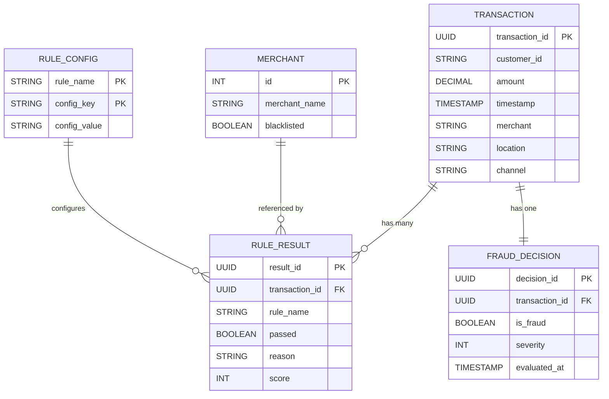

# Database Schema Diagram

```mermaid
erDiagram
    TRANSACTION {
        UUID transaction_id PK
        STRING customer_id
        DECIMAL amount
        TIMESTAMP timestamp
        STRING merchant
        STRING location
        STRING channel
    }

    RULE_RESULT {
        UUID result_id PK
        UUID transaction_id FK
        STRING rule_name
        BOOLEAN passed
        STRING reason
        INT score
    }

    FRAUD_DECISION {
        UUID decision_id PK
        UUID transaction_id FK
        BOOLEAN is_fraud
        INT severity
        TIMESTAMP evaluated_at
    }

    MERCHANT {
        INT id PK
        STRING merchant_name
        BOOLEAN blacklisted
    }

    RULE_CONFIG {
        STRING rule_name PK
        STRING config_key PK
        STRING config_value
    }

    TRANSACTION ||--o{ RULE_RESULT : "has many"
    TRANSACTION ||--|| FRAUD_DECISION : "has one"
    MERCHANT ||--o{ RULE_RESULT : "referenced by"
    RULE_CONFIG ||--o{ RULE_RESULT : "configures"
```
