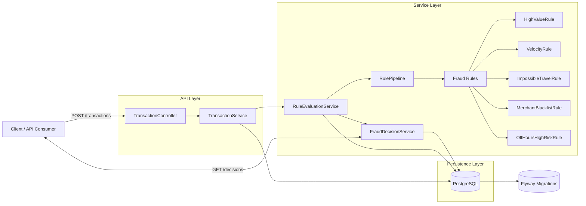

```mermaid
flowchart LR
    Client["Client / API Consumer"] -->|POST /transactions| TransactionController[TransactionController]

    subgraph API_Layer["API Layer"]
        TransactionController --> TransactionService[TransactionService]
    end

    subgraph Service_Layer["Service Layer"]
        TransactionService --> RuleEvaluationService[RuleEvaluationService]
        RuleEvaluationService --> RulePipeline[RulePipeline]
        RulePipeline --> FraudRules["Fraud Rules"]
        FraudRules --> HighValueRule[HighValueRule]
        FraudRules --> VelocityRule[VelocityRule]
        FraudRules --> ImpossibleTravelRule[ImpossibleTravelRule]
        FraudRules --> MerchantBlacklistRule[MerchantBlacklistRule]
        FraudRules --> OffHoursHighRiskRule[OffHoursHighRiskRule]

        RuleEvaluationService --> FraudDecisionService[FraudDecisionService]
    end

    subgraph Persistence_Layer["Persistence Layer"]
        FraudDecisionService --> PostgreSQL[(PostgreSQL)]
        TransactionService --> PostgreSQL
        RuleEvaluationService --> PostgreSQL
    end

    PostgreSQL --> Flyway[(Flyway Migrations)]
    Client <-->|GET /decisions| FraudDecisionService
```
