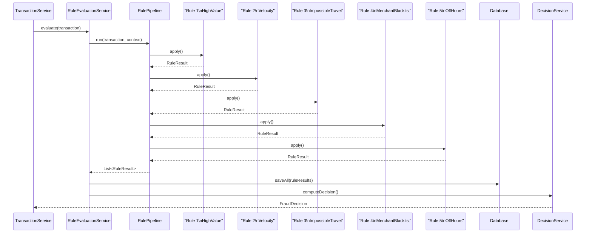

# Rule Pipeline Execution Diagram

```mermaid
sequenceDiagram
    participant T as TransactionService
    participant RE as RuleEvaluationService
    participant RP as RulePipeline
    participant R1 as "Rule 1\nHighValue"
    participant R2 as "Rule 2\nVelocity"
    participant R3 as "Rule 3\nImpossibleTravel"
    participant R4 as "Rule 4\nMerchantBlacklist"
    participant R5 as "Rule 5\nOffHours"
    participant DB as Database
    participant Decision as DecisionService

    T->>RE: evaluate(transaction)
    RE->>RP: run(transaction, context)

    RP->>R1: apply()
    R1-->>RP: RuleResult

    RP->>R2: apply()
    R2-->>RP: RuleResult

    RP->>R3: apply()
    R3-->>RP: RuleResult

    RP->>R4: apply()
    R4-->>RP: RuleResult

    RP->>R5: apply()
    R5-->>RP: RuleResult

    RP-->>RE: List<RuleResult>
    RE->>DB: saveAll(ruleResults)
    RE->>Decision: computeDecision()
    Decision-->>T: FraudDecision
```
